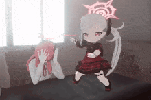

  

  

  

  <i>"I'm not professional, I'm just here for the vibes (and the bugs)."</i>

---

### 💫 About Me (if you care)

- 🤖 **Status:** 404 Brain Not Found (likely debugging a pointer).
- 🌍 **Timezone:** Living in a timezone that doesn't exist.
- 🎮 **Vibe:** Minimalist but chaotic, just like my code.
- 💀 **Philosophy:** If it works, don't touch it. If it doesn't work, blame the compiler.

  
  

  

---

### 🛠️ My "Expertise" (i.e. things I googled once)

  

  <i>"Docker image size: 2GB. Why? Don't ask."</i>

---

### 🌐 My Socials (stalk me here)

  
  

---

  
  

  

